# MapCreator
### Open source web-based map editor. The application lets you draw lines, polygons and place text with icons as markers. You can also export your map to PDF using your own HTML template. 
## Preview
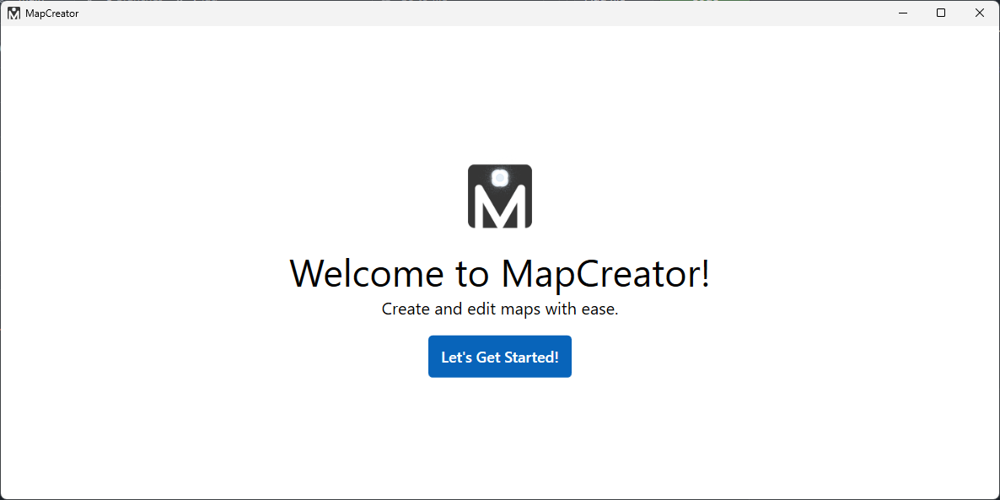

### Workspace
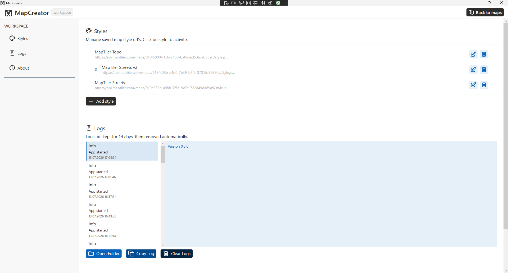

### Maps list page
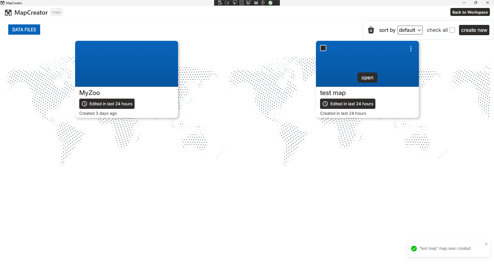

### New map page
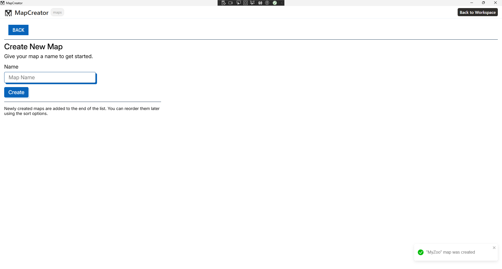

### Data files page and template preview
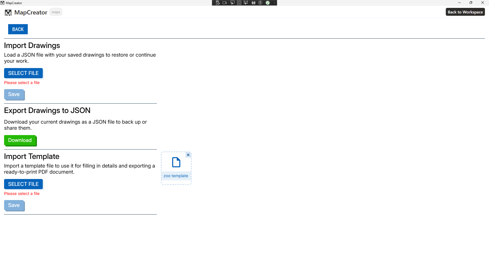
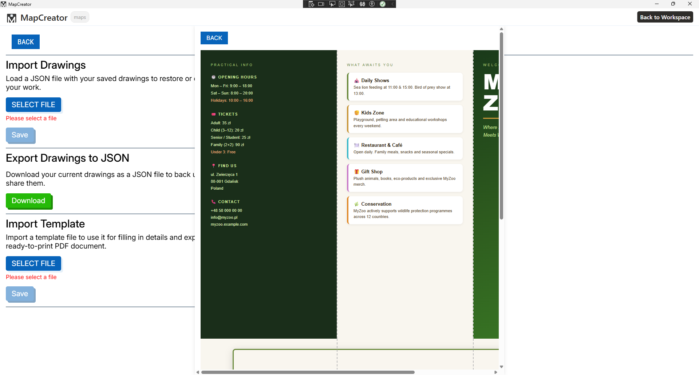

### Settings panel
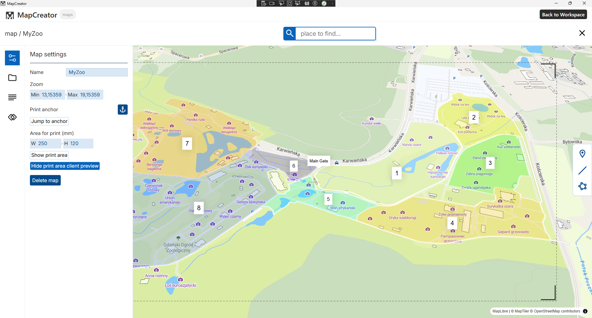

### Drawings panel
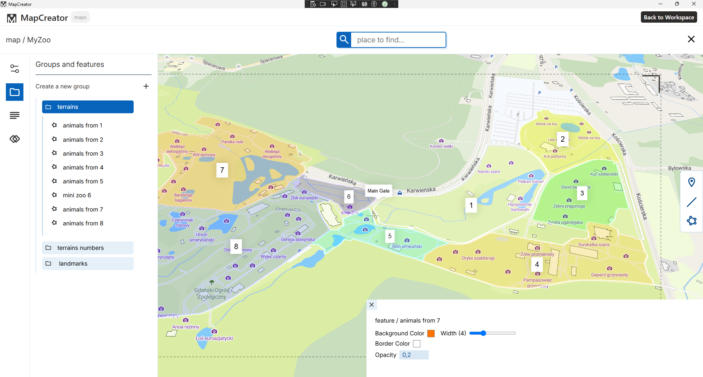

### Description panel
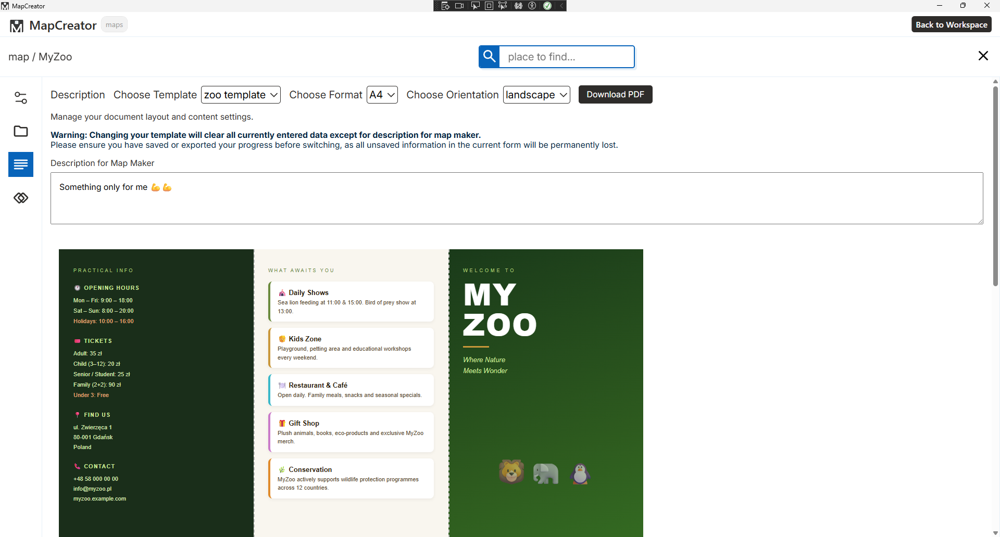
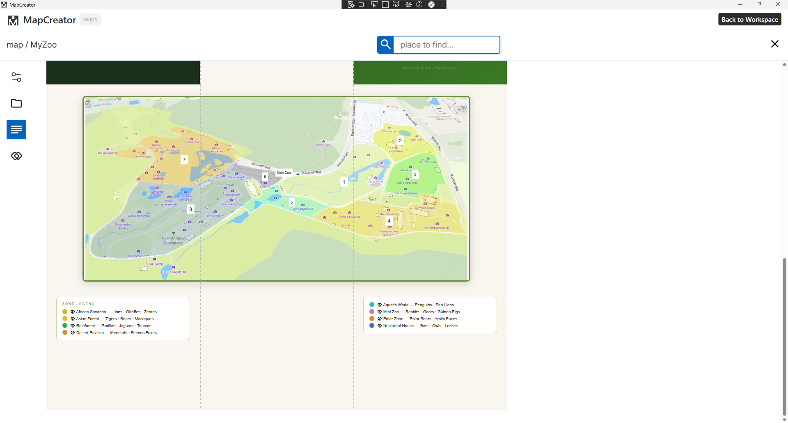

### Combine drawings panel
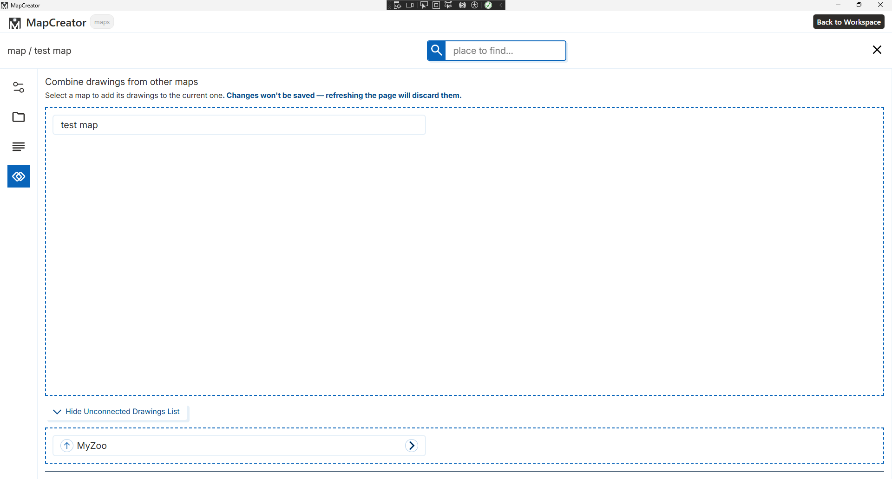

### Final product 
> Images of pdf pages
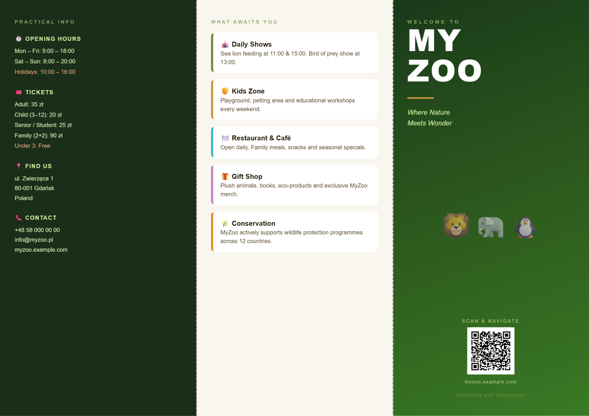
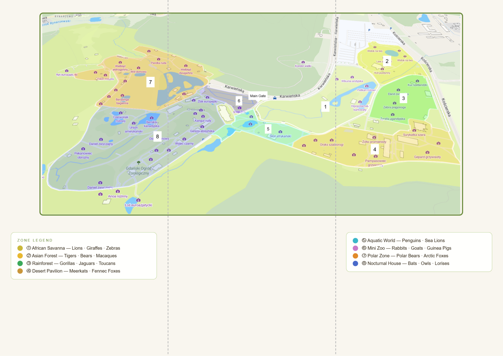

## Installation

### Desktop (Windows)
Download and run the installer from the [latest release](https://github.com/TimiDev-be/MapCreator/releases/latest).

> **Requirements:** Windows 10 or later (64-bit / 86-bit)

### Development
```bash
git clone https://github.com/TimiDev-be/MapCreator.git
cd desktop
dotnet run
```

> If you want to customize the application localhost port, edit `config.json` in `client/public`:
```javascript
{
  "api": {
    "link": "http://localhost:5550/api",
    "port": 5550
  }
}
```


### Features
- Draw, edit and delete lines, polygons and markers on the map
- Add descriptions to your maps
- Import custom HTML templates (see documentation for structure)
- Fill textarea and input fields directly within templates
- Export templates to PDF
- Add and edit your own map style URL

## Templates
### You can build your own *HTML* templates here is some example code:

```html
    <!--class "template" is required (width/height is in pixels -> a4 format in 96dpi) -->
    <div class="template" style="width: 793px; height: 1122px; padding: 20px;">
      <!--class "page" is required to define each page even if you want only one-->
      <div class="page" style="width: 100%; height: 100%;">
        <!--id "map-container" is required if you want to display the map -->
        <div id="map-container" style="width: 500px; height: 300px; padding: 10px; display: flex; justify-content: center; align-items: center;"></div>
        <!--id "qrcode" is required if you want to display the qr code for google map -->
        <div id="qrcode" style="width: 200px; height: 200px; padding: 10px;"></div>
        <div class="description-container" style="width: 500px; height: max-content; padding: 10px;">
            <h3>Description</h3>
            <!--All of textarea and inputs when template is loaded gets listeners to update the map description values so data can be saved.-->
            <textarea name="description" id="description-textarea" style="width: 100%; height: 100px; resize: none; font-size: 16px"></textarea>
        </div>
      </div>
    </div>
```

### Here is an example of how textarea / inputs values are stored in map.
> Name of textarea / inputs are used as keys in the values object.
```typescript
  map : any {
    ...prevmap,
    description: {
      ...prevmap.description,
      values : Record<string, string> = {
        "description": "some text"
      }
    }
  }
```

## License
This project is licensed under the [MIT License](LICENSE).
